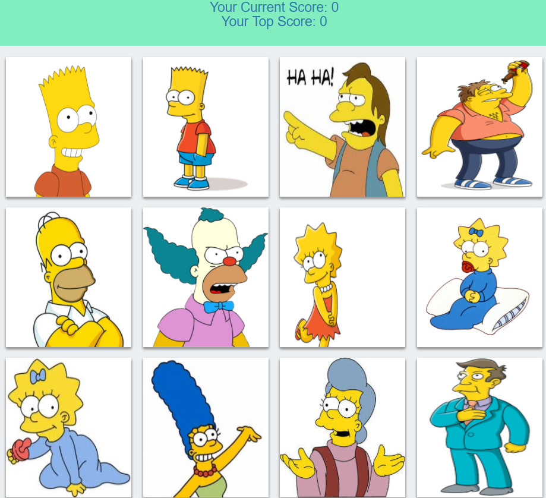

# Simpsons Clicky Game

In this memory game, you click a character image card to score a point. After each click, the image cards are shuffled. You can continue to score points by clicking other image cards. But if you click the same card more than once, you lose all of your points, and the round is over. If you click all 12 image cards only once, the round is also over.

# Sample Screenshot

The following image shows the character cards that you click to score points.  

# Tools Used

- React
- JavaScript
- css